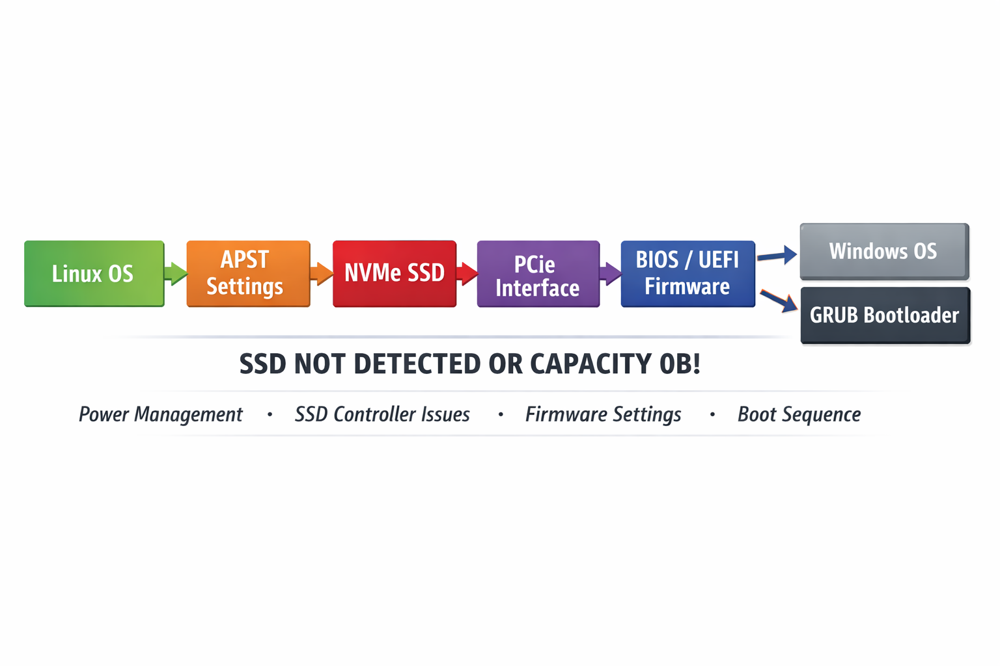

# NVMe SSD Issues in Linux: 0B Capacity, Drive Dropouts, and Dual-Boot Failures (Fix Guide)


> If your NVMe SSD shows **0B capacity**, randomly **disappears**, or **fails after reboot** in Linux or dual-boot setups — this guide provides a **proven fix**.

> A system-level issue caused by the interaction between NVMe power management, platform firmware, and OS initialization.
This repository documents a real-world debugging process of DRAM-less NVMe SSD issues across:

- Linux installation (device detected as 0B)
- USB enclosure usage (random dropouts)
- Internal M.2 usage (unstable detection)
- Dual-boot with Windows (restart bypassing GRUB / drive missing)

✅ Includes:
- Root cause analysis (power management & system interaction)
- Failed attempts (what *does NOT* work)
- Stable and reproducible fixes
Analysis and practical fixes for NVMe SSD issues (0B capacity, drive disappearance, and boot failures) in Linux and dual-boot environments, focusing on power management instability.

# Analysis and Resolution of Unconventional Issues with DRAM-less NVMe SSDs Preventing Normal Installation and Use of Linux-Windows Dual-Boot Environments Under Poorly Adapted and Complex Integrated Power Management
------
> My Basic Environment
Hardware: MECHREVO Yao Shi 15Pro, Intel i9-14900HX (14th Gen Mobile HX Series), RTX4060 Laptop GPU; dual M.2 NVMe slots, **Slot 1 is CPU-direct PCIe 4.0 x4 channel, Slot 2 is PCH-derived PCIe channel**;
Storage: Factory-installed Windows system drive (Slot 1, hereinafter referred to as Yangtze River Drive), newly added Western Digital Blue SN580 1TB NVMe SSD (DRAM-less design, **SanDisk self-developed controller**, **with automatic sleep management**), dedicated to installing Linux;
System: Original Windows 11 system; BIOS only allows disabling secure boot and VMD but has no option to set Intel RST; planned to install Ubuntu 22.04.5 (kernel 6.8+).

------

# Problem Introduction
On a bright and sunny day, I was just following various online tutorials to install a dual-boot system on my laptop, but encountered a complex set of issues with a DRAM-less NVMe SSD:
- Attempt 1: Installing the Linux system using an `m.2 hard drive + hard drive enclosure (controller: RTL9210B)` resulted in drive disconnection and system crash when writing a large number of fragmented small files (4K writes) to the drive after system installation;
- Attempt 2: Directly installing the hard drive into the laptop's second m.2 slot for a Linux dual-boot environment led to abnormal phenomena such as the NVMe device not being recognized or even disconnecting, capacity identified as 0B, unrecognizable partitions, and the drive disappearing again after reboot when installing via the live Ubuntu environment on a Ventoy boot disk.
- During this period, the Western Digital drive could be normally recognized and used in the Windows system, and there were no disconnection issues when using the hard drive enclosure as a regular data storage drive, basically ruling out hardware malfunctions.
- Even when restarting (warm start) in Windows right after the system was installed, the BIOS would fail to recognize the Western Digital drive directly, causing it to skip the grub boot, boot directly into Windows, and fail to see the Western Digital drive.

Through multi-stage troubleshooting and experiments in external USB (RTL9210B), internal M.2 slot, and dual-boot environments, this article finds that the problem is not caused by a single reason, but an interaction issue between the NVMe power management mechanism, platform firmware (BIOS/UEFI), and operating system initialization process.

By disabling NVMe deep power saving (APST) and adjusting the boot chain (GRUB/UEFI), the problem was stably resolved. This article provides the complete reproduction path, failed attempts, and final solution to serve as a reference for similar environments.

> Tutorials I Used:
>
> [Brother Jie's Bilibili Dual-Boot Tutorial](【Windows11 Installation Ubuntu Pitfall Avoidance Guide】https://www.bilibili.com/video/BV1Cc41127B9?vd_source=4fee1919587da67df22a63b9ee031587)
>
> [Simple Optimization for First-Time Ubuntu Use](【Ubuntu 24.04 LTS Must-Do 20 Things After Installation】https://www.bilibili.com/video/BV1A5SFYMEtD?vd_source=4fee1919587da67df22a63b9ee031587)
>
> [Install Ubuntu to Go on a Portable Hard Drive (referenced partition tutorial therein)](【【2024】Linux to go Install Ubuntu22.04 on Portable Hard Drive (Full Process)】https://www.bilibili.com/video/BV14BxRedEnG?vd_source=4fee1919587da67df22a63b9ee031587)
>
> [Install Ubuntu on a Portable Hard Drive](https://zhuanlan.zhihu.com/p/424967021)
>
> [Problems Encountered When Installing Ubuntu System](https://zhuanlan.zhihu.com/p/374663335)

------

# Core Problem Disassembly
### Root Cause 1: Drive "Sleep Death" Issue Caused by Incompatible `APST` Mechanism of Portable Hard Drive Enclosure Controller (for m.2 + portable hard drive enclosure)
APST (Autonomous Power State Transition) has poor compatibility with the Linux kernel on the RTL9210B controller, and this solution also generates significant heat. Using an external drive connected via USB interface has relatively stringent power supply requirements. Attempted solutions: replacing USB ports, suspecting temperature issues, suspecting power supply issues, replacing systems—none completely resolved the problem. Long-term tests found that in Ubuntu on the external drive, the drive disconnects immediately and the system freezes (the system is actually crashed) after about `10-20 minutes` of use; in worse cases, it may damage the Ubuntu boot files on the drive. The main issues are that the hard drive enclosure controller automatically selects to reduce power consumption and enter sleep mode due to short-term power supply drop, while Linux has poor compatibility with the controller's sleep mechanism—after the drive sleeps, it cannot be woken up by the system and directly "sleeps to death" leading to disconnection; in addition, a large number of small file writes in a short time cause the hard drive enclosure to heat up rapidly, the RTL9210B controller restarts, and Linux may also recognize the controller restart as a drive disconnection, resulting in actual disconnection.
Reference [Perfect Solution: Linux (Kali/Ubuntu) External Type-C Hard Drive Enclosure High-Load "Disconnection and Crash" Issue](https://hackmd.io/@BigDick/SycHO3NFZl)
> However, this did not actually solve the problem; my own tests only extended the disconnection from 10 minutes to 30 minutes, and there was still incompatibility between the external hard drive enclosure and the Linux kernel.
> Of course, some people in the community have tried adding power supply to the external drive and replacing it with a `ASMedia ASM` controller with Linux kernel maintenance, but I did not hold out much hope, and thought that installing a dual-boot system directly could avoid such issues, so I proceeded with the installation..

### Root Cause 2: Compatibility Bug Between SN580 Controller APST Power Management (DRAM-less SSD Feature) and Linux Generic Drivers (Most Core)
#### Core Characteristics of DRAM-less SSDs:
- No DRAM
- Uses HMB (Host Memory Buffer)
- Relies on host memory
- More aggressive power management
```text
✔ Easier to enter low-power states (APST)
✔ Controller state depends on the host
✔ More complex wake-up chain

After entering deep power-saving state
↓
Controller response delay or failure
↓
Operating system initialization failure
```
The NVMe specification defines the APST (Autonomous Power State Transition) feature: the SSD controller can autonomously switch between multiple power states (PS0~PS4) based on load, where PS0 is the full-speed working state and PS4 is the deep sleep state (lowest power consumption, only basic power supply is retained).
Consumer-grade DRAM-less SSDs (such as SN580) set the trigger threshold for deep sleep extremely low to optimize power consumption and heat generation (entering PS4 after being idle for hundreds of milliseconds), and its SanDisk self-developed controller has customized the PS4 state design: after entering deep sleep, it shuts down part of the circuits in the PCIe physical layer, only supporting the exclusive wake-up process of the official WD driver for Windows, and does not respond to the standard specification wake-up commands of the Linux generic NVMe driver.
- Thus, Windows/BIOS can recognize it normally (Windows has the exclusive WD driver and can wake up the sleeping SSD normally; BIOS does not allow the SSD to enter low-power states and keeps it in PS0 full speed throughout, so enumeration is normal);
- 0B recognition anomaly under Linux: after the SSD enters PS4 deep sleep and "sleeps to death", the Linux kernel can only enumerate the NVMe controller on the PCIe bus, cannot establish normal communication with the SSD controller, cannot perform normal `namespace initialization`, cannot read the LBA address space and partition table, thus displaying 0B, and all read/write operations report errors (`I/O ERROR`);
- Same root cause for external drive enclosure disconnection: the USB-NVMe bridge chip of the Ugreen hard drive enclosure has its own power management, which will superimpose and trigger the SSD's APST sleep; Linux's USB storage driver has more difficulty waking up the SSD that has "slept to death", resulting in random disconnections.
> I also tried to find solutions in the community, but basically, there were only questions without answers in the QA section. There were similar problems I encountered, where Western Digital DRAM-less SSDs could not be recognized, but no experts answered them.

### Root Cause 3: PCIe Enumeration Issue (Platform-Related)
> Mainly occurs right after the dual-boot system is installed, and the Linux system may or may not boot successfully.

During warm reboot (restart) in the Windows system (or when motherboard static electricity is not completely discharged during disassembly and assembly):
```
PCIe bus not fully reset
↓
NVMe controller unresponsive
↓
BIOS enumeration failure
```
Manifestation: NVMe disappears in BIOS.
At the same time, the UEFI BootNext mechanism (Windows behavior) may cause Windows to:
```
Set BootNext → Windows Boot Manager leading to:
Bypass BootOrder
↓
Bypass GRUB
```
Ultimately leading to:
```text
After entering deep power-saving state
↓
Controller response delay or failure
↓
Operating system initialization failure
```
> The problem is complex; it can only be considered to have an impact on the situation we encountered, but it cannot be regarded as the main cause.

### Root Cause 4: (Specifically for the Issue of Drive Disconnection After Restarting in the Windows Interface After System Installation) Warm Reboot Fails to Fully Reset the NVMe Controller and GRUB is Bypassed
```text
Windows sets BootNext
Bypass GRUB
```
**Superimposed with Root Cause 3, it is speculated that the power management strategy we set in GRUB to force high-performance operation does not take effect after bypassing GRUB**
> The essence of triggering the problem has not been fully identified, but it is not necessary; the solution idea for this is clear: force the BIOS's UEFI to boot from Ubuntu and only use shutdown instead of restart in Windows to ensure passing through GRUB.


# Failed Attempts
1. When running the Linux system with the RTL9210B hard drive enclosure: replacing USB ports, suspecting temperature issues, suspecting power supply issues, replacing systems, trying [this community article](https://hackmd.io/@BigDick/SycHO3NFZl)
**None completely resolved the problem**
2. Partitioning/Formatting:
Deleting partitions and rebuilding them for the drive in Windows, and force formatting in Linux (gparted)
**Invalid (essentially not a partition issue)**
3. Replacing slots: swapping M.2_1 / M.2_2, suspecting performance differences between "Slot 1 (CPU-direct PCIe 4.0 x4 channel) and Slot 2 (PCH-derived PCIe channel)"
**Partial improvement (change in enumeration probability) but not a permanent fix**
4. BIOS settings: disabling Secure Boot, disabling VMD (required operations for installing a dual-boot system, as recommended in the dual-boot tutorial at the beginning of the article), but since my laptop's BIOS cannot directly set AHCI and Intel RST, the reasoning is insufficient
**Necessary but insufficient**
5. Reinstalling the system repeatedly, plugging/unplugging the external hard drive repeatedly, reinserting the m.2 slot repeatedly, and even directly unplugging the Yangtze River drive and only installing the Western Digital drive to maintain a clean environment for system installation—still encountered the above issues
6. **Just futile rage**

# Key Solutions Obtained Through Attempts
 ### **Add the following to GRUB**:
```bash
nvme_core.default_ps_max_latency_us=0
nvme_core.multipath=0
pcie_aspm=off
```
Enter the Ubuntu system and execute the following commands to permanently solidify the kernel parameters that cure the SSD compatibility issue into the GRUB configuration:
```bash
# Edit the GRUB configuration file
sudo nano /etc/default/grub
# Add kernel parameters to the configuration line
GRUB_CMDLINE_LINUX_DEFAULT="quiet splash nvme_core.default_ps_max_latency_us=0 nvme_core.multipath=0 pcie_aspm=off"
# Save and exit, then update the GRUB configuration
sudo update-grub
sudo reboot
```
**Explanation of Functions**
1. nvme_core.default_ps_max_latency_us=0 (key parameter):
```text
Disable NVMe deep power saving (APST)
Restrict NVMe from entering deep low-power states
↓
Avoid controller "sleep death"
↓
Ensure successful initialization

✔ Directly resolve 0B / no partitions / unable to install issues
✔ Significant improvement in system stability
Main solution factor for this problem
```
2. nvme_core.multipath=0:
```
Function: Disable NVMe Multipath I/O
Multipath is used for enterprise-level storage (multiple control paths); generally not required for consumer-grade SSDs
Reduce initialization complexity
↓
Avoid potential compatibility issues
↓
Auxiliary stability parameter (recommended to keep)
```
3. pcie_aspm=off
```
Function: Disable PCIe ASPM (Active State Power Management), disable PCIe link layer power saving (L0s / L1)
ASPM is jointly controlled by BIOS + OS; some platforms have compatibility issues
✔ Certain mitigation for drive disconnection issues
❌ But not a decisive factor
⚠️ Increase power consumption
⚠️ Reduce laptop battery life
Non-mandatory parameter, only used when problems are severe
```
### GRUB Unified Boot Dual-Boot Cross-Reboot NVMe Disconnection Permanent Solution
**Function**: Solves the core pain point of Linux system NVMe SSD disconnection and recognition anomalies after Windows warm reboot, realizes conflict-free unified boot of dual systems, completely cures the SSD false death issue triggered by cross-system reboot, and sets it directly without delving into the reasons.
```
1.  Force all boot, cold start, and Windows warm reboot processes to first pass through the GRUB bootloader of the Ubuntu system drive, ensuring that the NVMe SSD is forcibly reset to a normal working state in any boot scenario;
2.  Implement visual unified boot of dual systems, allowing free selection of booting into Windows or Ubuntu systems in GRUB after startup, without repeatedly modifying the BIOS boot order;
3.  Completely resolve the issue of Linux system NVMe SSD disconnection and 0B capacity recognition anomalies after Windows warm reboot, without disabling the Windows restart function, ensuring the native usage experience of the primary Windows system;
4.  Adapt to scenarios with physically isolated ESP partitions on dual hard drives, and all boot operations are fully reversible with no risk of data loss or system crash.
```
> This solution is adapted to dual-hard drive physical isolation scenarios: M.2 Slot 1 is the Ubuntu system drive (WD Blue SN580) with its own independent ESP boot partition; M.2 Slot 2 is the Windows factory system drive with its own independent ESP boot partition. All operations are natively supported by the system with no reliance on third-party tools.
> Choosing to insert the Western Digital drive into the first M.2 slot also minimizes unexpected instability factors.

#### Step 1: BIOS Boot Priority Configuration
1.  Power on the computer and press the corresponding hotkey for the motherboard (F2 in this scenario) to enter the UEFI BIOS settings interface;
2.  Enter the [Boot] tab, set the **UEFI boot item corresponding to the Ubuntu system drive** as the first boot priority, and Windows Boot Manager as the second priority;
3.  Save the BIOS configuration and exit to ensure the motherboard prioritizes reading the GRUB bootloader of the Ubuntu system drive by default at startup.

#### Step 2: Set GRUB's Default Boot Option and UEFI Boot Order in Ubuntu
1. **Configure GRUB to Remember the Last Boot Item**
```bash
sudo nano /etc/default/grub
```
Modify to:
```bash
GRUB_DEFAULT=saved
GRUB_SAVEDEFAULT=true
```
Update:
```bash
sudo update-grub
```

---
**Effect**: GRUB will remember the last system selected by the user
Example:
```text
Last boot into Windows → default to Windows next time
```

---

2. **Modify UEFI Boot Order**
Use:
```bash
sudo efibootmgr
```
View the current order:
```text
BootOrder: 0004,0003
```
Modify to: (if the displayed current ubuntu number is 0003)
```bash
sudo efibootmgr -o 0003,0004
```
UEFI will then prioritize attempting to boot Ubuntu, ensuring entry into GRUB.

---

**Effect**
```text
All Windows restart behaviors:
↓
Enter GRUB
↓
User selects system
```

---

The **system boot chain** becomes:
```text
Power On / Restart
↓
UEFI
↓
GRUB
↓
User Selection (Ubuntu / Windows)
```

---

**Notes**
```text
1. GRUB_DEFAULT=saved provides "user-level control"
2. efibootmgr provides "firmware-level priority"
3. bcdedit provides "Windows layer interception"
```

#### Emergency Handling Plan
If the GRUB rescue mode (`grub>` prompt) appears after modifying the boot configuration, emergency recovery can be performed in the following two ways:
1.  **Temporarily Boot Windows**: Restart the computer, press the motherboard boot hotkey (F12 in this scenario) to enter the boot item selection menu, manually select [Windows Boot Manager] to boot directly into the Windows system, and execute the above boot recovery commands to restore (or reselect the priority boot system option in BIOS);
2.  **Manually Boot Ubuntu**: At the `grub>` prompt, execute the `ls` command to enumerate disk partitions, locate the Ubuntu root partition, manually load the kernel and initrd image, and execute the `boot` command to start the Ubuntu system. After entering the system, execute `sudo update-grub` and `sudo grub-install` to repair the GRUB configuration.

# Experimental Results and Method Effect Verification
After application:
```text
✔ Normal disk recognition
✔ Normal partition display
✔ Successful system installation
```
- Basic recognition repair: The Linux system can normally recognize the WD SN580 SSD, with normal capacity display, normal partitioning, formatting, reading and writing of data, and no 0B recognition anomalies;
- Long-term stability: Continuous operation without disconnection or read/write errors, no anomalies in system restart or cross-system cold restart;
- Conflict-free dual-system switching: Both boot schemes achieve conflict-free switching between dual systems, with no issues such as boot overwriting or GRUB rescue mode;
- Hierarchical resolution of root causes for the problem: The three-level root causes of the problem are resolved layer by layer, completely eliminating NVMe device recognition anomalies and disconnection issues, rather than temporary mitigation;
- Two dual-system boot schemes are provided, adapting to two different usage needs: "primary Windows use" and "frequent dual-system switching";
- Disabling the APST function causes the NVMe SSD to maintain full-speed working state throughout, resulting in a slight decrease of ≤5% in laptop battery life under battery mode and a 1~2℃ increase in SSD temperature (completely within the normal working range), without affecting the service life of the SSD;
- Applicable to the following scenarios:
Brand laptops/desktops with UEFI BIOS locking Intel RST RAID mode and unable to switch to AHCI;
Consumer-grade DRAM-less NVMe SSDs experiencing recognition anomalies, 0B capacity, disconnection, and inability to read/write in Linux systems;
Deployment of Windows-Linux dual systems with issues such as cross-system restart disconnection and boot conflicts.

------

# Discussion
Although the sole root cause of the problem cannot be fully determined,
the experimental result that the problem stably disappears after disabling NVMe APST
indicates that the problem is highly correlated with instability during NVMe power state switching,
and it can be regarded as one of the main influencing factors.

Considering that the problem involves multi-layer interactions such as the operating system, device firmware, platform PCIe behavior, and power management strategies,
its essence is closer to a system-level coupling phenomenon
rather than a defect of a single component.

Therefore, excessive attribution to a single cause is not made here;
instead, key factors that can stabilize system behavior are identified through controlled variable experiments,
and based on this, reproducible and verifiable solutions are proposed.

> This is not a simple hardware failure, but a **system-level issue caused by the interaction between NVMe power management, platform firmware, and OS initialization.**
